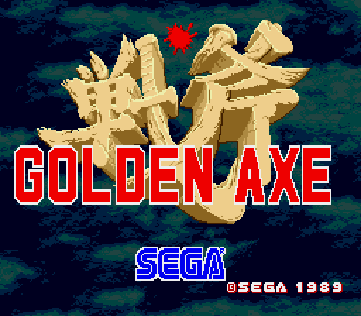
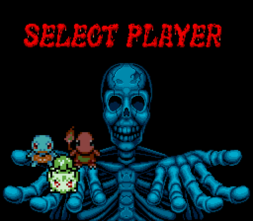
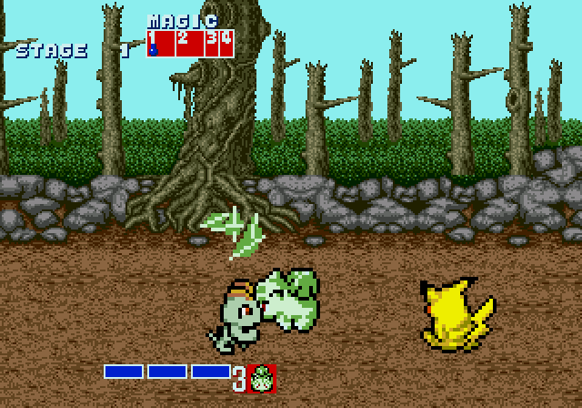
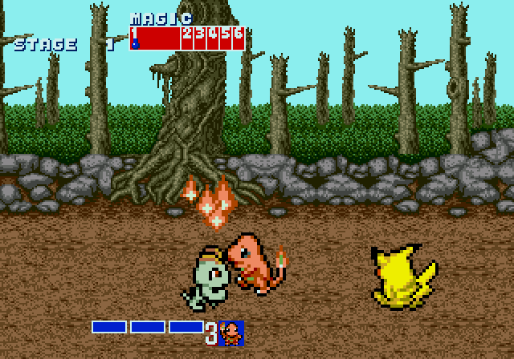
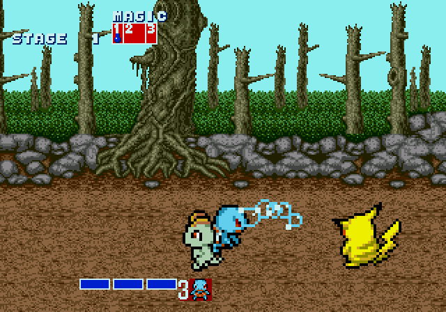
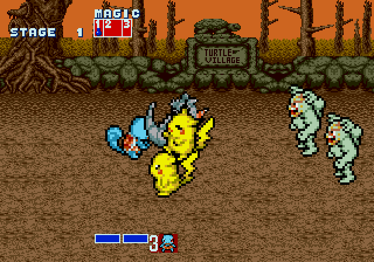
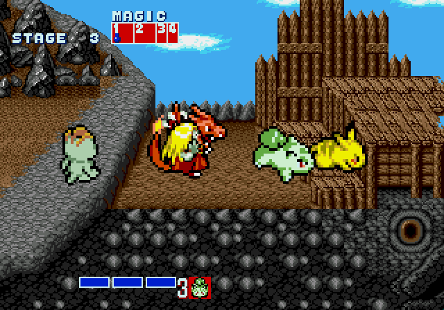
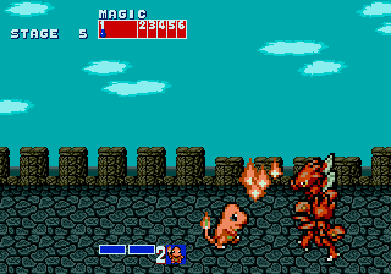
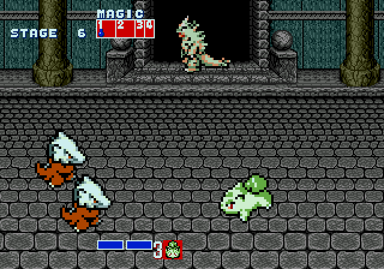

# PokéAxe

**Golden Axe (Sega Mega Drive / Genesis) — rebuilt with Pokémon.** Version 1.1.

Play as Bulbasaur, Charmander or Squirtle and fight your way through all eight stages of Golden Axe against
Pokémon foes, each with its own sprites, animations and cry. It is still Golden Axe underneath: the same levels,
music, magic, timing and hit boxes.

| | |
|---|---|
|  |  |

**Trailer:** [PokeAxe-trailer.mp4](https://github.com/idanboa/pokeaxe/releases/latest/download/PokeAxe-trailer.mp4) (real gameplay, recorded in an emulator)

| | |
|---|---|
|  |  |
|  |  |
|  |  |
|  | |

## What's changed

**Heroes**

| Golden Axe | PokéAxe | Attack |
|---|---|---|
| Ax Battler | Bulbasaur | Razor Leaf |
| Tyris Flare | Charmander | Ember |
| Gilius Thunderhead | Squirtle | Bubble |

New select screen and HUD portraits. Every attack fills its real hit box with the Pokémon's element, so what you
see is what hits.

**Foes** — every soldier, monster, mount and boss except the thieves and villagers:

| Golden Axe | PokéAxe |
|---|---|
| Heninger (club soldiers) | Pikachu |
| Longmoan (mace soldiers) | Machop |
| Amazons | Jynx |
| Skeletons | Marowak |
| Bad Brothers (giants) | Machamp |
| Lt. Bitter (knights) | Scizor |
| Death Adder | Tyranitar |
| Beaked mount (Bizarrian) | Rhydon |
| Blue & red dragons | Charizard |

Each Pokémon foe cries when hit and when knocked out (classic Game Boy-era cries).

**Gameplay**

- Wider attack lane: you no longer need to line up pixel-perfectly to connect (depth tolerance 8 → 14 px).

## How to play

You need your own copy of the original cartridge ROM. This repository does **not** contain any ROM.

| | |
|---|---|
| Required ROM | Golden Axe (World) (Rev A) — No-Intro name |
| Size | 524,288 bytes |
| CRC32 | `665D7DF9` |
| SHA-1 | `2CE17105CA916FBBE3AC9AE3A2086E66B07996DD` |

1. Download `PokeAxe-1.1.bps` from the [latest release](https://github.com/idanboa/pokeaxe/releases/latest) (also in [`patch/`](patch/)).
2. Apply it to the ROM above with any BPS patcher, for example [Floating IPS](https://github.com/Alcaro/Flips) or the browser-based [ROM Patcher JS](https://www.marcrobledo.com/RomPatcher.js/).
   The patcher will refuse a different ROM revision.
3. Play the result in any Mega Drive / Genesis emulator, for example:

   | Emulator | Platforms |
   |---|---|
   | [OpenEmu](https://openemu.org) | macOS |
   | [RetroArch](https://www.retroarch.com) with the [Genesis Plus GX](https://github.com/libretro/Genesis-Plus-GX) core | Windows, macOS, Linux, Android, iOS |
   | [BlastEm](https://www.retrodev.com/blastem/) | Windows, macOS, Linux |

   Tested in Genesis Plus GX (OpenEmu and libretro).

Patched ROM: 1,048,576 bytes, CRC32 `FEF0E9E2`, SHA-1 `44641FE5EFB60AC55421B959368328EA9E37DD63`.

**Controls** (Mega Drive pad): **B** attack, **C** jump, **A** magic. Double-tap a direction to run; run + attack for a
dash attack.

## Known issues

- Death Bringer, the final boss, uses Death Adder's graphics in a different palette (as in the original game), so he
  appears as a recoloured Tyranitar; his throne-sitting intro pose is still the original art.
- Heroes ride mounts at the original riding height, which can look high on the Pokémon mounts.
- Thieves and villagers are unchanged.
- Big foes (giants, knights, Death Adder, mounts) keep all their frames in video memory, so they have 4–8 key poses
  rather than full animation sets.

## Building from source

Everything is generated by scripts in [`tools/`](tools/) from the original ROM plus downloaded sprites and cries;
[`tools/mod.json`](tools/mod.json) describes every reskin, palette and patch.

Requirements: Python 3 with Pillow and `imageio-ffmpeg`, and the [vasm](http://sun.hasenbraten.de/vasm/) 68000
assembler (`make CPU=m68k SYNTAX=mot`, binary expected at `.tools/vasm/vasmm68k_mot`).

```sh
tools/fetch_assets.sh                                   # sprites + cries into assets/
python3 tools/build.py tools/mod.json "Golden Axe (World) (Rev A).md" out/PokeAxe.md
python3 tools/bps.py create "Golden Axe (World) (Rev A).md" out/PokeAxe.md out/PokeAxe.bps
```

Optional: `tools/emu.py`, `tools/bot.py` and `tools/trailer.py` drive a locally built
[Genesis Plus GX](https://github.com/libretro/Genesis-Plus-GX) libretro core for automated playtesting and the trailer.

| Script | What it does |
|---|---|
| `build.py` | Builds the ROM: sprite conversion, palettes, HUD, select screen, cries, gameplay patches |
| `garom.py` | Readers for Golden Axe's animation, metasprite and DMA formats |
| `nemesis.py` | Sega Nemesis tile compression (decoder + encoder) |
| `cries.py` | Converts cries to the sound driver's 4-bit DPCM samples |
| `bps.py` | BPS patch writer / applier |
| `emu.py`, `bot.py`, `trailer.py` | Emulator harness, scripted player, trailer recorder |

## For AI coding agents

See [AGENTS.md](AGENTS.md) for repository rules, the build/verify loop and the engine facts discovered while making this.

## Credits

See [CREDITS.md](CREDITS.md). Built by [idanboa](https://github.com/idanboa) with the help of Claude Code.

## Legal

PokéAxe is a free, non-commercial fan project and is not affiliated with or endorsed by Sega, Nintendo, Game Freak,
Creatures Inc. or The Pokémon Company. Golden Axe © SEGA. Pokémon © Nintendo / Creatures Inc. / GAME FREAK inc.
No ROMs are distributed here. The code in `tools/` is MIT-licensed (see [LICENSE](LICENSE)); the sprites and
cries it uses are not, and are covered by their own terms (see [CREDITS.md](CREDITS.md)).
