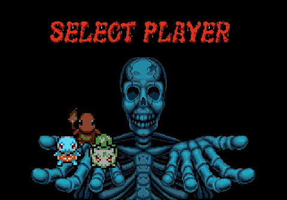

# PokéAxe

Golden Axe for the Sega Mega Drive, played as **Bulbasaur, Charmander and Squirtle** — against Pokémon.

## Trailer

| | |
|---|---|
|  |  |
|  |  |

## Play

1. Get the original ROM: [Golden Axe (World) (Rev A)](https://vimm.net/vault/2046) — CRC32 `665D7DF9`.
2. Download [**PokeAxe-1.1.bps**](https://github.com/idanboa/pokeaxe/releases/latest/download/PokeAxe-1.1.bps) and apply it to the ROM with [ROM Patcher JS](https://www.marcrobledo.com/RomPatcher.js/).
3. Play it in [OpenEmu](https://openemu.org) (Mac), [RetroArch](https://www.retroarch.com) (everywhere) or [BlastEm](https://www.retrodev.com/blastem/) (Windows, Mac, Linux).

**Controls:** B attack · C jump · A magic · double-tap to run

---

Made by [idanboa](https://github.com/idanboa) with Claude Code · [Credits](CREDITS.md) · [Build from source](docs/DEVELOPMENT.md)

A free fan project, not affiliated with Sega, Nintendo or The Pokémon Company. Golden Axe © SEGA. Pokémon © Nintendo / Creatures / GAME FREAK. No ROMs included.
